 

<!-- Below banner: lanyard floats left (no table = no borders), badges sit centered beside it -->

      

  

 

---

### 💫 About Me

Full-Stack Engineer and AI Systems Architect with 5+ years of experience spanning e-commerce, production-grade web applications, and AI-driven platforms. Founder of **Operator Control Systems** (industrial AI, HMI/SCADA, Zero Trust) and **Batch Systems** (premium web experiences for global clients). Delivered 13+ AI systems and 15+ high-performance web products.

- 🔭 **Currently working on:** New client projects at Batch Systems and Operator Control Systems, plus AI automation tooling.
- 🌱 **Currently learning:** Advanced Framer Motion and GSAP/ScrollTrigger patterns, and event-driven architecture for real-time apps.
- 👯 **Looking to collaborate on:** AI-first SaaS products or visually complex, full-stack web applications.
- 💬 **Ask me about:** LLM orchestration and agentic workflows, HMI/SCADA and industrial AI, or turning Figma designs into live code.

---

### 🏢 Companies I've Founded

| Company | Focus | Since |
|---|---|---|
| **[Batch Systems](https://batchsystems.space)** | Premium web experiences, dashboards, and full-stack applications for global clients | 2025 |
| **Operator Control Systems** | Industrial AI platforms, HMI/SCADA interfaces, Zero Trust security, predictive maintenance | 2025 |
| **Watch Mafia** | Watch resale e-commerce with a custom stack, 5 successful DTC brand exits (2021 to 2024) | 2021 |

### 🔑 Key Skills

  <!-- Core languages / frameworks -->
  
  
  
  
  
  

  <!-- Back-end / DB / infra -->
  
  
  
  

  <!-- Front-end / UI -->
  
  
  
  

  <!-- Architecture / AI / tooling -->
  
  
  
  

  <!-- Misc -->
  
  
  

---

### 🛠️ Tech Stack

  
  
  
  
  
  
  
  
  
  
  
  

---

### 📊 GitHub Stats

  

  

  

  

  

  

